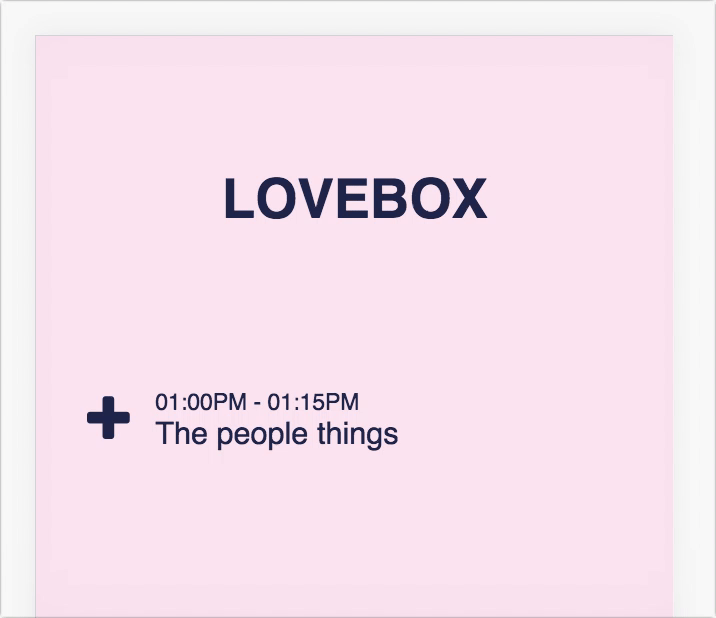

I've decided not to spend a absurd amount of work on blog posts and just try to
write down my thoughts more. Maybe I'll get better at writing in the process but
in the mean time there are going to be some posts that are mostly just written
for my own benefit. This is one of those posts.

Ever since I went to [Secret Solstice](https://secretsolstice.is) in 2016 I
thought about creating a simple web-app to track the acts I wanted to see and
browse the other acts to help me decide on what I want to see when not seeing
something on my personal schedule. Essentially the same thing as their own
[app](https://itunes.apple.com/us/app/secret-solstice-festival-2016/id1115236296?mt=8)
but a web-app instead of a native one.

This idea crept back up in anticipation of going to
[Lovebox](http://loveboxfestival.com/) this year with my friend Haukur. and so
I've started of with by scaffolding a small typescript app using a small
modification of the original create-react-app, aptly named
[create-react-app-typescript](https://github.com/wmonk/create-react-app-typescript).

The first problem I've been contemplating is how I can make it apparent to the
user that they are adding a act to their schedule. Here's what I've got so far.

I feel like the animation speed and function is a bit off but am unsure on how
it should feel. Browsing through [dribbble](https://dribbble.com) makes me feel
like it should be doing something really extravagant but I'd like to try to keep
things as simple as possible.

Another thing I'm thinking about is that I got the icon from
[fontawesome](http://fontawesome.io/) but would prefer a SVG I could edit but
haven't found a good SVG editor to change icons from
[the noun project](https://thenounproject.com/). It also feels very thick and
has smooth curves while the Lovebox website theme doesn't have a lot of smooth
curves.

Current thoughts to try are something like making the fonts thicker to look
better next to such a thick icon and maybe introducing the concept of "My
Schedule" will help me figure out a good way to convey the concept in the
button.